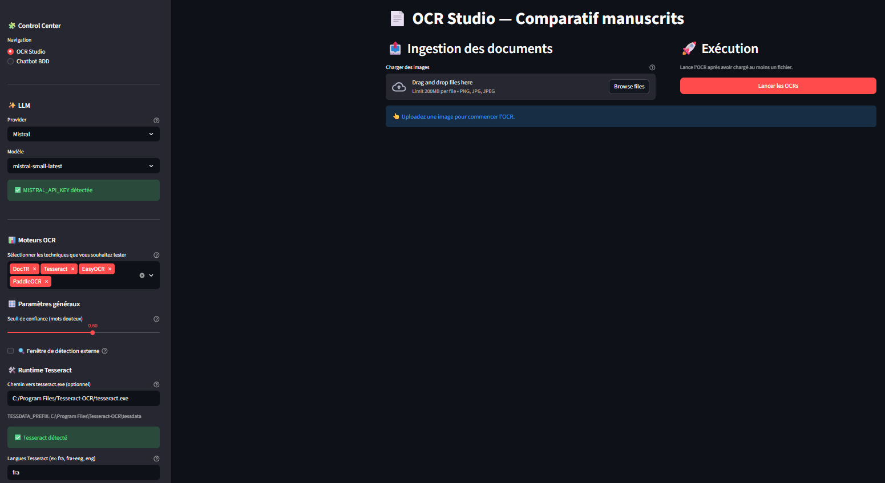
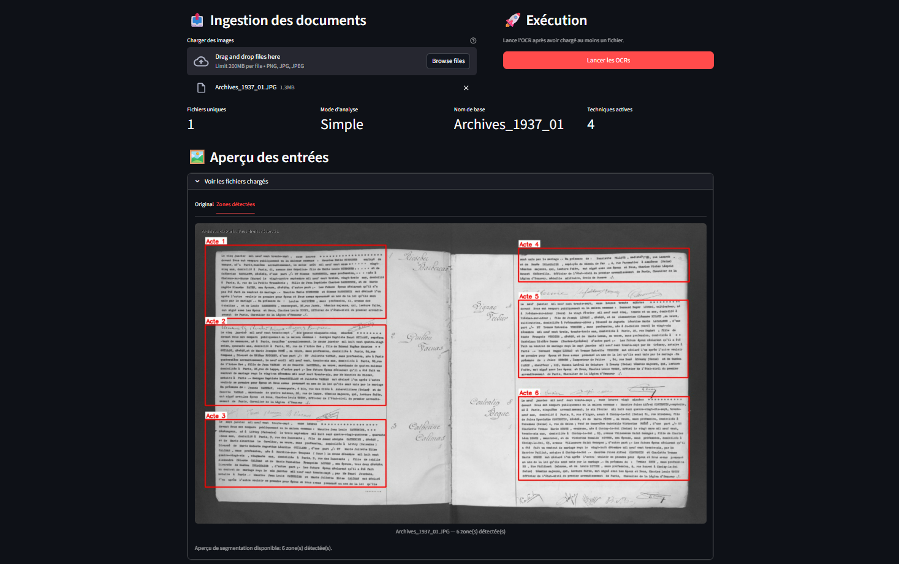
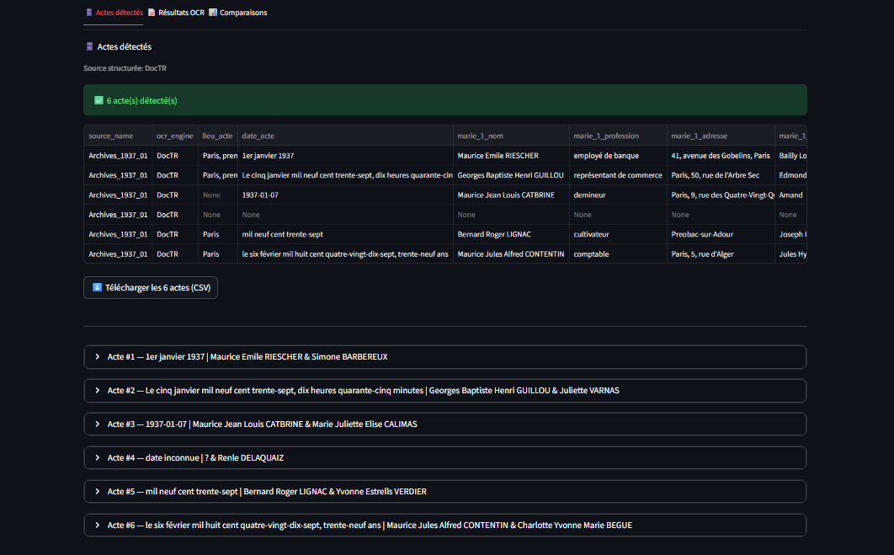
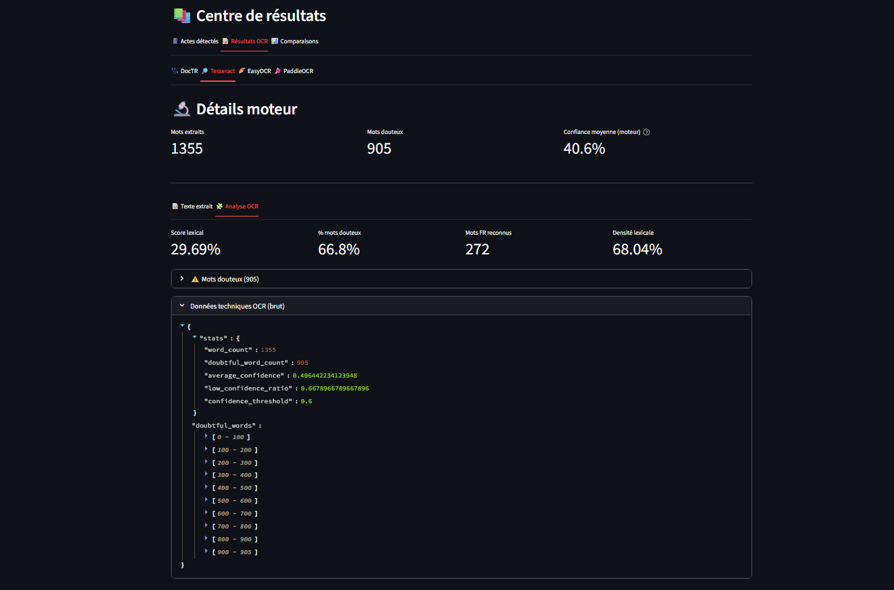
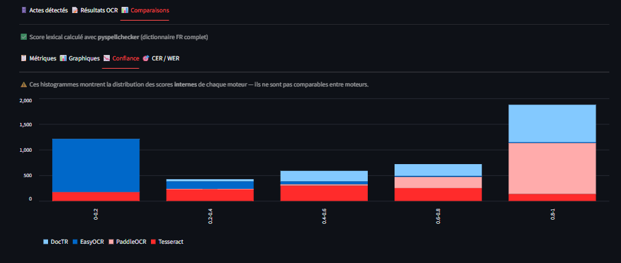
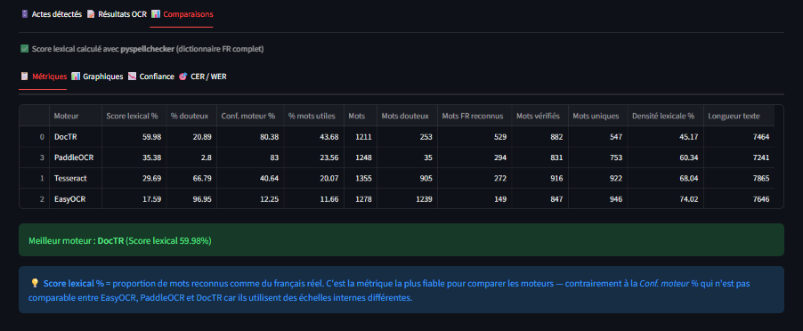
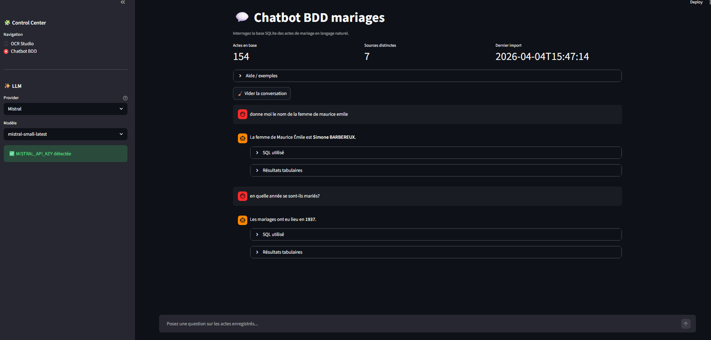

# IA-APPLICATION — Sujet 1: reconnaissance et traitement de données d’actes d’état civil antérieurs à 1950

## 1) Installation 

### Prérequis
- Python 3.10+
- `uv` installé (`pip install uv` si besoin)
- Tesseract OCR (obligatoire si vous activez ce moteur)

### Installation Tesseract (Windows)
1. Télécharger l’installateur recommandé (UB Mannheim) :
	- https://github.com/UB-Mannheim/tesseract/wiki
2. Installer Tesseract
3. Vérifier le chemin, typiquement :
	- `C:/Program Files/Tesseract-OCR/tesseract.exe`

### Installation des dépendances Python avec uv
Depuis la racine du projet :

```bash
uv venv
```

Windows (PowerShell) :

```bash
.venv\Scripts\activate
```

Puis :

```bash
uv pip install -r requirements.txt
```

## 2) Configuration `.env`

Créer un fichier `.env` à la racine :

```env
GROQ_API_KEY_CY=...
MISTRAL_API_KEY=...
TESSERACT_CMD=C:/Program Files/Tesseract-OCR/tesseract.exe
TESSERACT_LANG=fra
```
GROQ_API_KEY_CY n'est pas obligatoire.

Le provider/modèle LLM est par défaut:
 `mistral-small-latest` pour la correction sémantique.

## 3) Lancement

```bash
streamlit run app.py
```

## 4) Interface 

L’application est organisée en deux vues principales accessibles depuis la sidebar :
- **OCR Studio** : chargement d’images, segmentation, OCR, résultats et comparaison.
- **Chatbot BDD** : interrogation en langage naturel de la base `actes_mariage`.

### 4.1 Écran d’accueil OCR Studio

<!-- Remplacer le chemin ci-dessous par votre capture -->


### 4.2 Aperçu des entrées (Original / Zones détectées)

<!-- Remplacer le chemin ci-dessous par votre capture -->


### 4.3 Centre de résultats (onglets Actes / OCR / Comparaisons)

Après le lancement OCR, la lecture des résultats se fait en 3 étapes naturelles.

---

**Étape 1 — Vérifier les actes détectés**

Objectif : confirmer que les actes segmentés ont bien été extraits et structurés.



---

**Étape 2 — Contrôler la qualité OCR par moteur**

Objectif : lire le texte extrait et inspecter les indicateurs utiles (score lexical, mots douteux, etc.).



---

**Étape 3 — Comparer les moteurs entre eux**

Objectif : décider du moteur le plus fiable selon les métriques de comparaison.






### 4.4 Vue Chatbot BDD

<!-- Remplacer le chemin ci-dessous par votre capture -->



## 5) Prétraitement (détaillé)

Le prétraitement est réalisé avant OCR pour isoler chaque acte de mariage.

### Étapes du pipeline
1. **Décodage & redimensionnement**
	- l’image source est décodée puis redimensionnée (largeur max) pour stabiliser la détection.
2. **Passage en niveaux de gris**
	- transformation en grayscale pour les traitements morphologiques.
3. **Détection des zones de texte**
	- segmentation basée sur le pipeline de `decoupage.py`.
4. **Extraction des boîtes de paragraphes/actes**
	- récupération des bounding boxes `(x1, y1, x2, y2)` ordonnées par lecture.
5. **Découpage en crops (un acte par image)**
	- chaque boîte produit un crop PNG envoyé ensuite aux moteurs OCR.
6. **Aperçu visuel**
	- une image annotée (rectangles + labels d’actes) est générée et affichable dans l’aperçu des entrées.

### Ce que cela apporte
- meilleure séparation des actes sur une même page,
- OCR plus propre acte par acte,
- extraction structurée plus robuste,
- traçabilité visuelle des zones détectées.

## 6) Fonctionnalités implémentées

### OCR & structuration
- OCR comparatif avec 5 moteurs : `DocTR`, `Tesseract`, `EasyOCR`, `PaddleOCR`, `MistralOCR`.
- Cache disque unifié des résultats OCR (`Archives/ocr_cache/`) avec stockage par paragraphe/acte.
- Correction sémantique optionnelle via LLM (Groq ou Mistral).
- Extraction structurée des actes de mariage (JSON + CSV).
- Insertion automatique des actes en base SQLite (`mariages.db`).

### Évaluation
- métriques OCR (mots extraits, mots douteux, confiance moyenne),
- score lexical / densité lexicale,
- comparaison inter-moteurs,
- CER/WER (si vérité terrain fournie).

### Chatbot BDD
- page dédiée **Chatbot BDD**,
- requêtes en langage naturel sur `actes_mariage`,
- génération SQL par LLM avec exécution sécurisée en lecture seule (`SELECT`).

## 7) Utilisation

### OCR Studio
1. Charger une image.
2. Lancer les OCR.
3. Consulter les onglets du centre de résultats :
	- **Actes détectés**
	- **Résultats OCR**
	- **Comparaisons**

### Chatbot BDD
1. Aller sur **Chatbot BDD** dans la sidebar.
2. Poser une question sur les actes enregistrés.
3. Le chatbot affiche : réponse, SQL utilisé, résultats tabulaires.

## 8) Architecture du projet

- `app.py` : point d’entrée Streamlit
- `app_core/ui/` : sidebar, résultats, chatbot
- `app_core/pipeline/` : OCR runner, base de données, client LLM, prétraitement
- `app_core/common/` : utilitaires OCR
- `adapters/` et `OCRs/` : implémentations moteurs OCR
- `decoupage.py` : segmentation des actes

## 9) Sorties produites

- base SQLite : `mariages.db`
- cache OCR : `Archives/ocr_cache/*.json`
- exports CSV/TXT depuis l’interface
- dossiers de segmentation/crops : `resultats_detection/`

